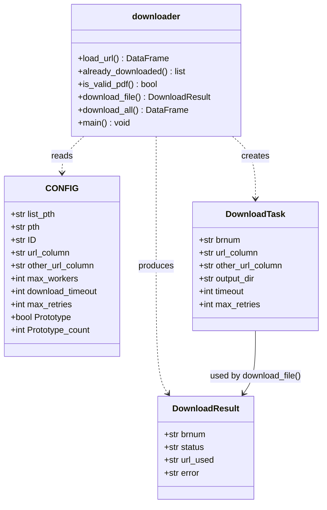
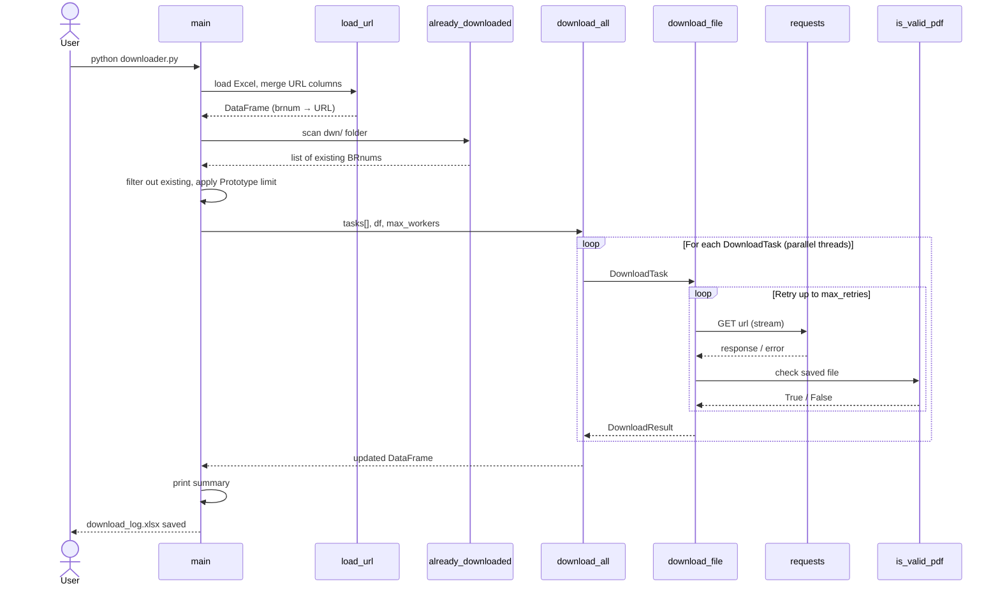
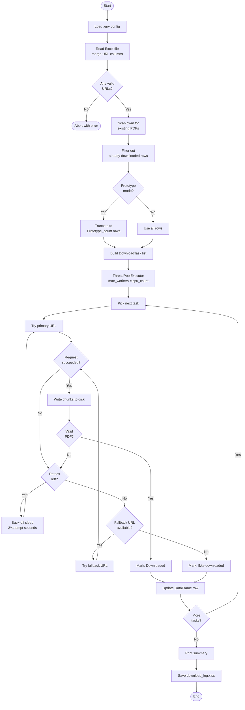

# PDF Downloader — UML Diagrams

---

## 1. Class Diagram

```mermaid
classDiagram
    class CONFIG {
        +str list_pth
        +str pth
        +str ID
        +str url_column
        +str other_url_column
        +int max_workers
        +int download_timeout
        +int max_retries
        +bool Prototype
        +int Prototype_count
    }

    class DownloadTask {
        +str brnum
        +str url_column
        +str other_url_column
        +str output_dir
        +int timeout
        +int max_retries
    }

    class DownloadResult {
        +str brnum
        +str status
        +str url_used
        +str error
    }

    class downloader {
        +load_url() DataFrame
        +already_downloaded() list
        +is_valid_pdf() bool
        +download_file() DownloadResult
        +download_all() DataFrame
        +main() void
    }

    downloader ..> CONFIG : reads
    downloader ..> DownloadTask : creates
    downloader ..> DownloadResult : produces
    DownloadTask --> DownloadResult : used by download_file()
```

---

## 2. Sequence Diagram

```mermaid
sequenceDiagram
    actor User
    participant main
    participant load_url
    participant already_downloaded
    participant download_all
    participant download_file
    participant requests
    participant is_valid_pdf

    User->>main: python downloader.py
    main->>load_url: load Excel, merge URL columns
    load_url-->>main: DataFrame (brnum → URL)

    main->>already_downloaded: scan dwn/ folder
    already_downloaded-->>main: list of existing BRnums

    main->>main: filter out existing, apply Prototype limit
    main->>download_all: tasks[], df, max_workers

    loop For each DownloadTask (parallel threads)
        download_all->>download_file: DownloadTask
        loop Retry up to max_retries
            download_file->>requests: GET url (stream)
            requests-->>download_file: response / error
            download_file->>is_valid_pdf: check saved file
            is_valid_pdf-->>download_file: True / False
        end
        download_file-->>download_all: DownloadResult
    end

    download_all-->>main: updated DataFrame
    main->>main: print summary
    main-->>User: download_log.xlsx saved
```

---

## 3. Activity Diagram

```mermaid
flowchart TD
    A([Start]) --> B[Load .env config]
    B --> C[Read Excel file\nmerge URL columns]
    C --> D{Any valid\nURLs?}
    D -- No --> E([Abort with error])
    D -- Yes --> F[Scan dwn/ for\nexisting PDFs]
    F --> G[Filter out\nalready-downloaded rows]
    G --> H{Prototype\nmode?}
    H -- Yes --> I[Truncate to\nPrototype_count rows]
    H -- No --> J[Use all rows]
    I --> K[Build DownloadTask list]
    J --> K

    K --> L[ThreadPoolExecutor\nmax_workers = cpu_count]

    L --> M[Pick next task]
    M --> N[Try primary URL]
    N --> O{Request\nsucceeded?}
    O -- No --> P{Retries\nleft?}
    P -- Yes --> Q[Back-off sleep\n2^attempt seconds]
    Q --> N
    P -- No --> R{Fallback URL\navailable?}
    R -- Yes --> S[Try fallback URL]
    S --> O
    R -- No --> T[Mark: Ikke downloaded]

    O -- Yes --> U[Write chunks to disk]
    U --> V{Valid\nPDF?}
    V -- No --> P
    V -- Yes --> W[Mark: Downloaded]

    W --> X[Update DataFrame row]
    T --> X
    X --> Y{More\ntasks?}
    Y -- Yes --> M
    Y -- No --> Z[Print summary]
    Z --> AA[Save download_log.xlsx]
    AA --> AB([End])
```
